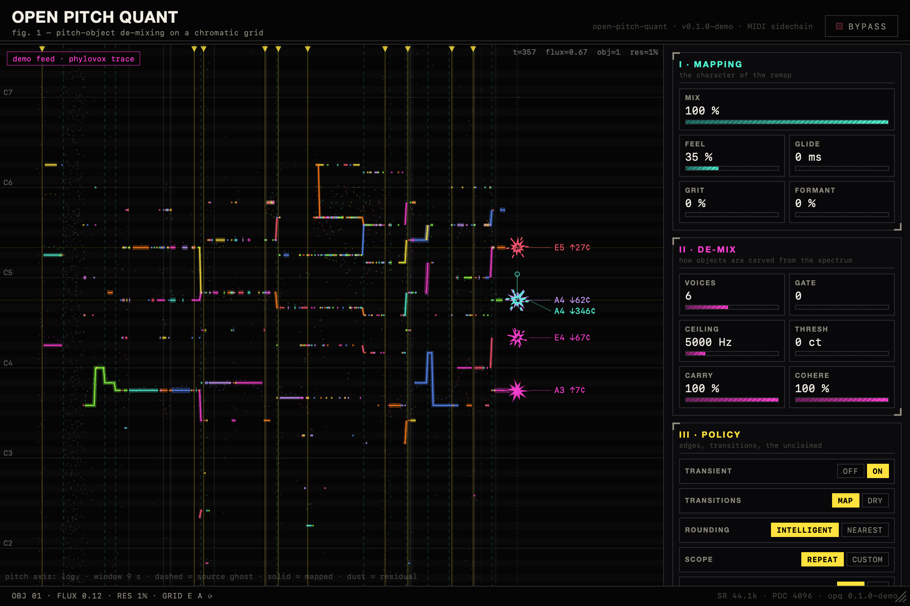

# open pitch quant

An open reimplementation of the *idea* of Zynaptiq PITCHMAP — real-time
**polyphonic pitch remapping**, MIDI-sidechain flavor: hold a chord, and
everything pitched in the audio is pulled onto it. Chords to chords, no
stem separation, ~93 ms latency, live.



## What's here

- **`rt/engine`** — the DSP, plain Rust. Pitch-object de-mixing on a
  chromatic grid: STFT → instantaneous frequency → greedy multi-F0
  grouping → per-object retuning via kernel-stamped partials with
  per-harmonic phase accumulators. **Read
  [`docs/DSP.md`](docs/DSP.md) for the full walkthrough.**
- **`rt/cli`** — offline renderer (`opq in.wav out.wav --midi part.mid`),
  used by the listening-test bench; also dumps analysis traces
  (`--viz-dump`).
- **`wrac/`** — the plugin: CLAP + VST3 + AU (`aumf`, so hosts route MIDI
  to it), built on NovoNotes' WRAC template (vendored, MIT) with a
  WebView GUI — a live display of the engine's tracked pitch objects.
  See [`docs/GUI.md`](docs/GUI.md).
- **`opq/`** — the frozen Python prototype lab (nine listened iterations;
  the Rust engine is canonical).
- **`docs/research/`** — the PITCHMAP evidence corpus this was built
  against. **`LISTENING-LOG.md`** — every listening batch and verdict.
  **`PATHS-NOT-TAKEN.md`** — deferred design branches, with reasons.

## Build

Nix (flake) carries the toolchain:

```sh
nix develop

# offline CLI
cd rt && cargo build --release
./target/release/opq in.wav out.wav --notes C4,E4,G4 --rounding intelligent --feel 0.35

# plugin (CLAP + VST3 + AU), GUI included
cd wrac/plugins/opq/src-gui && npm install && npm run build && cd ../../..
cargo xtask install -p opq_plugin_wrac --release   # --release matters: debug DSP underruns
```

macOS needs only Command Line Tools (the vendored build is patched to not
require full Xcode; the optional standalone-app target is the one
exception — it wants `ibtool`).

GUI design work runs in a plain browser: `npm run dev` in
`wrac/plugins/opq/src-gui` replays a real engine trace in demo mode.

## Status

Working and daily-driven in Ableton (VST3). AU validates (`auval -v aumf
Opq1 Opqt`). Reference A/B against actual PITCHMAP renders pending
(probe suite ready in `testdata/`). No license chosen yet; if you want to
use this for something, open an issue.

*This project reimplements a publicly documented idea from scratch — no
Zynaptiq code, no disassembly; see `docs/research/` for the sources. Not
affiliated with Zynaptiq. Go buy PITCHMAP, it rules.*
