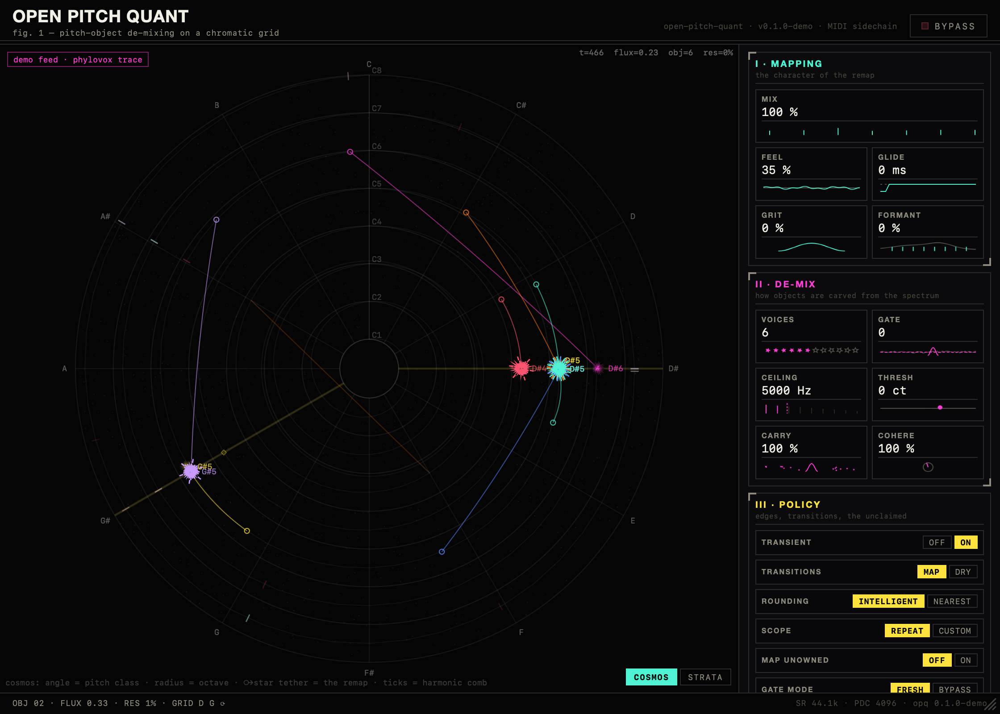
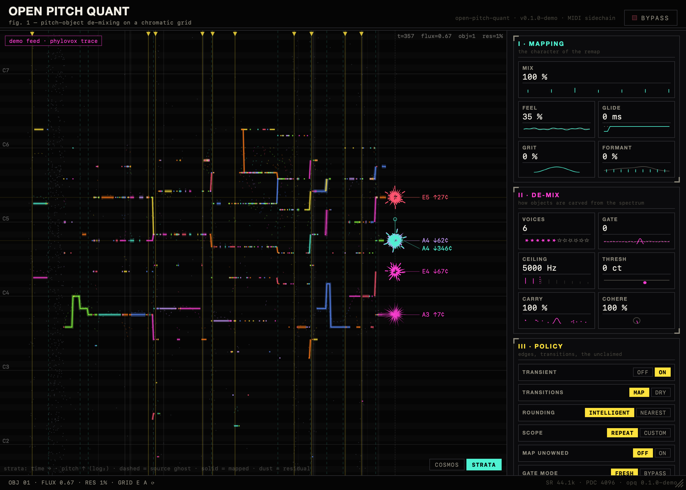
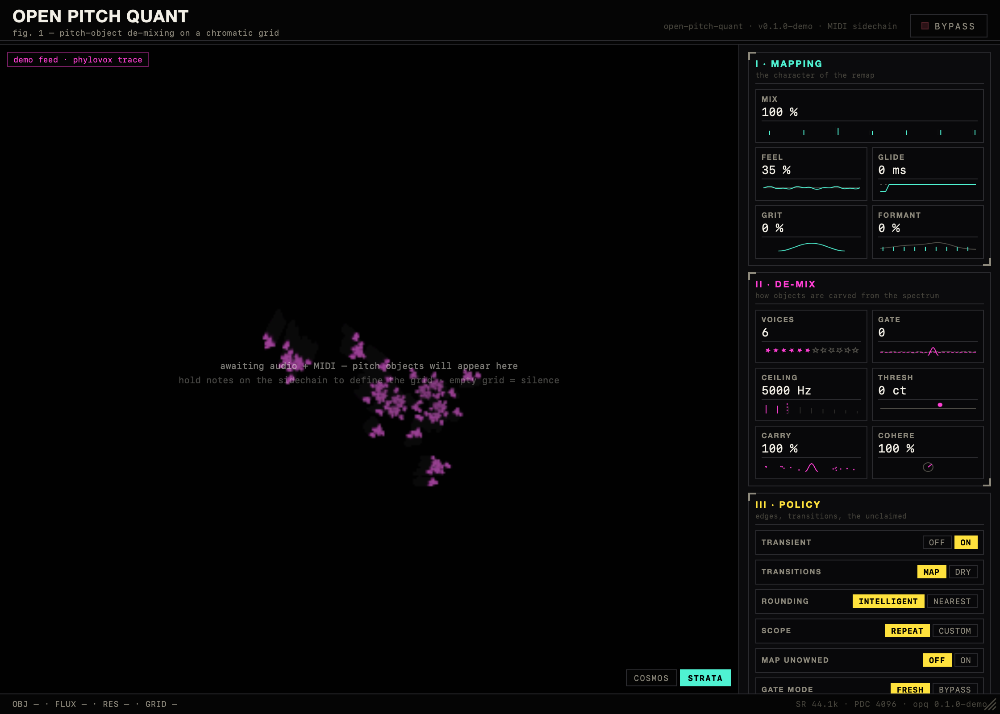
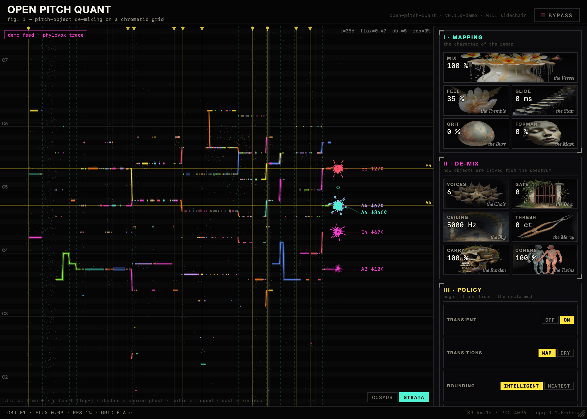
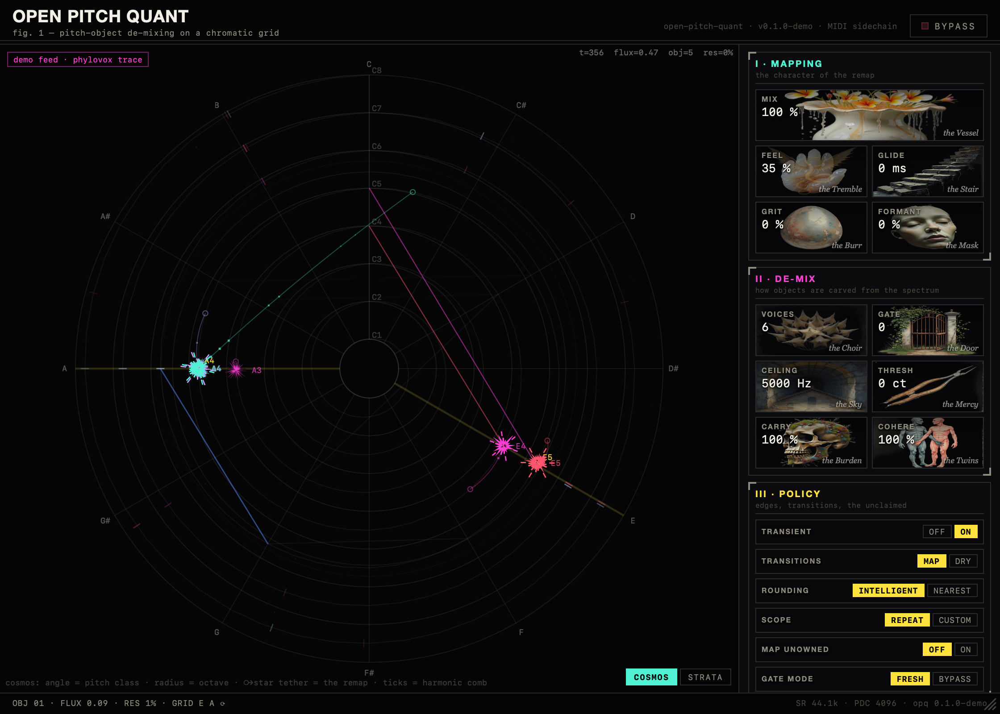

# The OPQ GUI — "the grove"

*(v1, 2026-07-07 — round 2, after Sam's interface notes: "overly
conventional… get creative… beat the everliving fuck out of this,
harmoniously." Design references in `design-refs/`.)*



## Two ways of seeing

**COSMOS** (default) — the mapping as a cosmogram, present-tense. Pitch
class is angle, octave is radius, so the pitch continuum is a spiral
through the wheel. Held MIDI notes are a lit constellation — **Repeat
scope lights entire pitch-class spokes, Custom lights single diamond
nodes**, so the scope switch is visible as geometry. Every pitch object
is a star at its OUTPUT pitch, tethered across the wheel to a hollow
ghost at its SOURCE pitch: the tether *is* the remap. Harmonic-comb ticks
spiral outward from each star (h2 = same angle one ring out, h3 = a fifth
around…). The residual layer is a nebula placed by true octave-band
energy from the engine; transients are shockwave rings from the core;
retunes leave comet-trail arcs.

**STRATA** — the time view: the echogram (leftward scroll, output ribbons
+ dashed source ghosts, strata, leader-line callouts, dust).

Switch bottom-right of the display; the choice persists.

## The star, anatomized

Each glyph is a live portrait of one pitch object — every visual channel
is an engine quantity:

| feature | meaning |
|---|---|
| spike count | harmonics claimed this frame (`nh`) |
| size | claimed spectral energy |
| spin rate | remap tension — cents the source is being pulled |
| positional wobble | source micro-pitch motion (the thing Feel re-injects) |
| hollow + rays | newborn (inside the transition-policy window) |
| spike pattern & color | stable identity (hashed from the track uid) |

**Hover any star** for its dossier: source pitch and detune, target,
pull, harmonic count, relative amplitude.

## Control figures

Every continuous parameter's block face is a tiny animated
software-rendered diagram of its own DSP mechanism (`figures.ts`): MIX
crossfades a dry and wet comb; FEEL is a wiggle whose amplitude is the
knob; GLIDE stretches a retune ramp; GRIT roughens a clean Hann lobe;
VOICES is literally N filled stars; GATE raises a floor a peak must
prove itself above; CEILING cuts a comb; THRESH is the in-tune amnesty
band with a wandering source dot; FORMANT holds an envelope while the
comb slides under it; CARRY fades the between-partial skirt; COHERE is a
pair of channel phasors converging. The plugin illustrates its own
organs — no stock widgets, no assets, all procedural.

**Every control has hover text** describing the mechanism and the
musical result. Drag = coarse, shift-drag = fine, wheel = trim,
double-click = default, click the value = type.

## Idle state

Before any audio arrives the display runs a small fractal-flame IFS
(chaos game over drifting sinusoidal/swirl variations, `flame.ts`) — the
plugin dreaming until you give it sound.




## Architecture

```
engine (rt/engine)          plugin (wrac/plugins/opq)         GUI (src-gui)
VizFrame ring (16, no      audio.rs publishes via try_lock    grove.ts renders
alloc) per hop; now    →   SharedState VecDeque (64)     →    both modes at rAF;
with residual octave       GUI timer (33ms) drains → JSON     controls.ts + figures.ts
bands                      over wxp Channel "viz-frames"      render the rail
```

- Parameter manifest (`get_parameter_manifest`): Rust is the single
  source of truth for ranges/defaults/choices.
- Viz payload field names match the CLI `--viz-dump` JSON-lines format;
  browser demo mode replays a baked phylovox trace (`demoTrace.ts`,
  regenerate: CLI `--viz-dump` → `tools/make_demo_trace.mjs`).
- Window: default 1120×800, minimum 920×780 — **the rail never scrolls**
  at any allowed size.

## Dev workflow

- Browser: `npm run dev` in `src-gui` → demo mode. URL params:
  `?mode=strata` forces the time view, `?idle` keeps the feed empty (for
  the flame).
- Hot reload in a DAW: install a *debug* build (points at the Vite dev
  server). Debug DSP is ~50× slower — reinstall `--release` after.
- Screenshots without a browser: `tools/shot.swift` (offscreen
  WKWebView — the plugin's actual rendering engine).

## The Meltdown Bestiary (v2, round 3)

Every continuous parameter is kept by a **Warden** — a specimen generated
by Flux (RunPod) in two painted aspects, unmulted onto the void
(luminance→alpha, so glowing edges survive), crossfaded by the value. The
Vessel (mix, drought↔flood) · the Tremble (feel) · the Stair (glide) ·
the Burr (grit) · the Mask (formant) · the Choir (voices) · the Door
(gate) · the Sky (ceiling) · the Mercy (thresh) · the Burden (carry) ·
the Twins (cohere). Three heroes (Vessel, Tremble, Burr) wake into
WAN-2.5-generated motion while dragged. Contact sheet:
`img/bestiary-contact.png`. Regeneration: `tools/` scripts pattern, needs
`RUNPOD=` in `~/.env`; ~$1.50 for the full set.

**The controls are the model** — the cosmos obeys them live: Feel scales
the star's re-injected source wobble (the star renders the *heard* pitch,
lema-EMA mirror of the engine); Glide becomes the on-screen retune ramp;
Mix crossfades visual weight between the wet star-layer and the dry
ghost-layer; Grit roughens every glyph's edges; Coherence at less than
100% sunders each star into two drifting channel-twins; remap tension is
matter — particle grains stream along each tether from source ghost into
the star, more and faster the harder the pull. Bypass stamps the field.




## Known limitations

- Standalone app target needs `ibtool` (full Xcode) for its menu nib;
  CLAP/VST3/AU unaffected.
- Star callouts cap at the loudest 8 objects (engine reports up to 24).
- Diffusion-rendered texture skin (runpod) discussed and parked — the
  current surface is 100% procedural; revisit if wanted.
