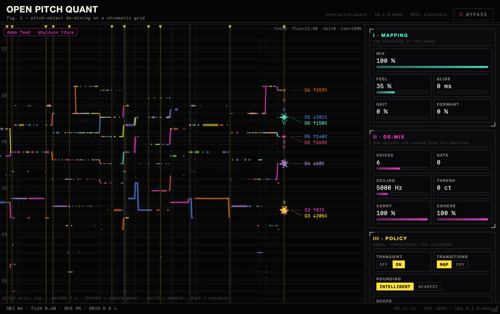
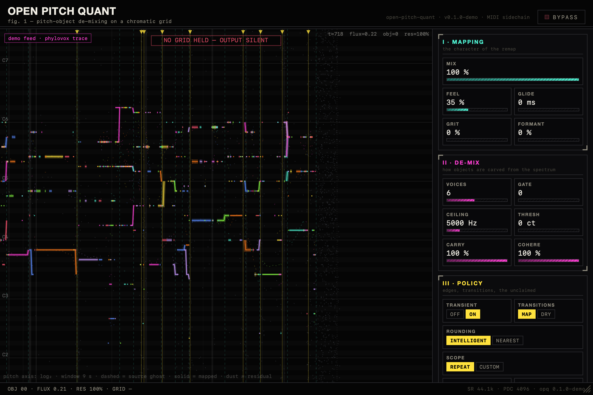

# The OPQ GUI — "the grove"

*(v0, 2026-07-04 — the overnight design session. Design references live in
`design-refs/`; the brief was "jagged-maximalism", decidedly NOT
PITCHMAP-looking, full creative freedom.)*


## What it is

A scientific plate crossed with a 1990s SCADA screen, set on the void.
Three surfaces:

1. **The grove** (main canvas) — a live echogram of the engine's mind.
   Time scrolls leftward; pitch is vertical (log₂). Every tracked pitch
   object is a **jagged glyph** whose spike pattern is hashed from its
   identity, trailing a ribbon of its OUTPUT pitch, with a dashed ghost of
   its SOURCE pitch. The vertical stem between them at the head line is the
   remap itself, drawn live, with a leader-line label giving the target note
   and remap distance in cents (`A4 ↓62¢`). Held MIDI notes are yellow
   strata (lit + tagged when an object sits on them); the residual layer is
   dust; hard transients are burst-marked seams; chord changes are dashed
   cyan seams. Empty grid shows the alarm box: `NO GRID HELD — OUTPUT
   SILENT` (the PITCHMAP contract, stated plainly).

2. **The rail** — three numbered instrument clusters generated from the
   Rust parameter manifest: `I·MAPPING` (mix hero block, feel, glide, grit,
   formant), `II·DE-MIX` (voices, gate, ceiling, threshold, carry,
   coherence), `III·POLICY` (single-line chip switches). Data-blocks, not
   knobs: drag anywhere on a block (shift = fine), wheel to trim,
   double-click to reset, click the value to type. Begin/end edit gestures
   are sent to the host so automation recording and undo work.

3. **The status strip** — live `OBJ · FLUX · RES% · GRID` readout left,
   `SR · PDC · host` right.

## Architecture

```
engine (rt/engine)          plugin (wrac/plugins/opq)         GUI (src-gui)
VizFrame ring (16, no      audio.rs publishes via try_lock    grove.ts renders
alloc) filled per hop  →   SharedState VecDeque (64)     →    at rAF; controls.ts
                           GUI timer (33ms) drains → JSON      binds manifest
                           over wxp Channel "viz-frames"
```

- The **manifest** (`get_parameter_manifest`) makes Rust the single source
  of truth for ranges/defaults/choices; the GUI renders generically.
- The **viz payload** field names match the CLI's `--viz-dump` JSON-lines
  format exactly, so the browser demo mode replays a real baked phylovox
  trace (`src/demoTrace.ts`, regenerate with
  `tools`-style: `opq in.wav out.wav --midi ... --viz-dump trace.jsonl`
  then `node make_demo_trace.mjs`).

## Dev workflow

- **Browser design loop**: `npm run dev` in `src-gui`, open
  `http://127.0.0.1:5173/` — demo mode auto-engages (magenta badge),
  replaying the phylovox trace on loop.
- **Hot reload inside a DAW**: install a *debug* build (`cargo xtask
  install -p opq_plugin_wrac`) — debug builds point the WebView at the Vite
  dev server. **Debug DSP is ~50× slower; reinstall `--release` after.**
- **Release**: `npm run build` in src-gui (build.rs zips `dist/` into the
  binary), then `cargo xtask install -p opq_plugin_wrac --release`.
- Screenshot loop without a browser: `scratchpad/shot.swift` pattern — an
  offscreen WKWebView (the plugin's actual rendering engine) → PNG.

## States




## Deliberate choices

- **Truthful chaos**: tracker churn (short-lived uids) renders as dashed
  confetti — that's diagnostic signal, not noise. When the tracker holds, a
  ribbon appears; when it doesn't, you see exactly that.
- Labels cap at the loudest 8 objects; leader lines keep the callout column
  legible during dense polyphony (mandel-decomp callout language).
- Palette: acid jewel tones hashed per object identity on near-black;
  strata yellow; alarm red reserved for bypass + empty-grid.
- No external assets — fonts are system (Helvetica titling, SF Mono data);
  everything works inside the plugin's zip-served WebView offline.

## Known limitations

- **Standalone app target doesn't build on Command Line Tools alone**:
  clap-wrapper's standalone compiles a `MainMenu.xib` with `ibtool`, which
  ships only with full Xcode. CLAP/VST3/AU are unaffected. Fix paths:
  install Xcode once, or upstream-patch the wrapper to build its menu
  programmatically.
- Grove labels cap at 8 objects; the engine reports up to 24 per frame.
